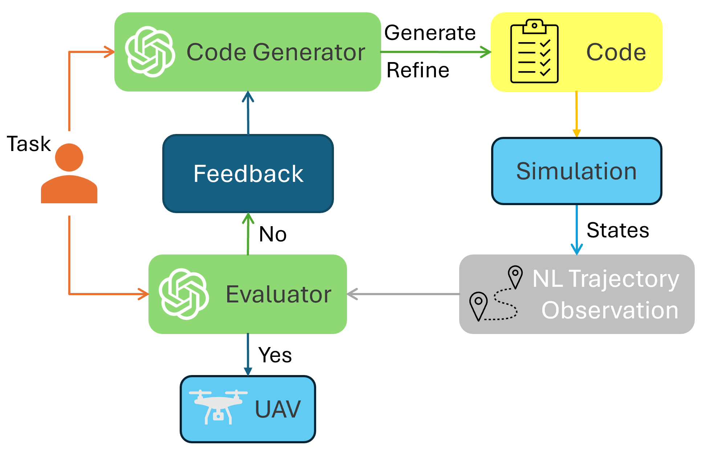
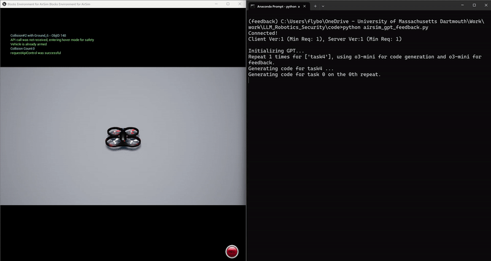

# Large Language Model-Driven Closed-Loop UAV Operation with Semantic Observations

In this study, we propose a LLM-driven closed-loop control framework that enables reliable UAV operations powered by effective feedback and refinement using two LLM modules, i.e., a **Code Generator** and an **Evaluator**. Our framework transforms numerical state observations from UAV operations into natural language trajectory descriptions to enhance the evaluator LLM's understanding of UAV dynamics for precise feedback generation.

<p align="center">
   
</p>

## Demonstration

<p align="center">
  
</p>

## Setup

### AirSim Setup

1. Install [AirSim](https://github.com/microsoft/AirSim).

2. Download pre-build AiSim environment ["Releases"](https://github.com/Microsoft/AirSim/releases), recommend downloading "Block".

### OpenAI Setup

Please make sure you have set the `OPENAI_API_KEY` environment variable, if not:

```bash
export OPENAI_API_KEY="your_openai_api_key"
```

### Python

   Note: This project is tested under python `3.9.23`.

1. (Optional) Create a new virtual environment to prevent Python library conflicts.

2. Install AirSim Python library [AirSim Python APIs](https://microsoft.github.io/AirSim/apis/).
3. Install Python libraries:

   ```bash
   pip install openai
   pip install numpy
   ```

---

## Usage

1. Clone this repository:

   ```bash
   git clone https://github.com/ai-uavsec/CLGSCE.git 
   cd CLGSCE
   ``` 

2. Open AirSim "block" or other "pre-built" environment, make sure the environment has a open space (at least a 20-meter cubic) for drone flight.

3. Active the virtual environment created in [Python](#python) setup.

4. Run python file.

   ```bash
   python CLGSCE.py -m NL -t advanced
   ```

   -m, --method {GSCE,self-refine,numerical,NL}, the default method is "NL".

   -t, --task {basic,advanced}, the default task set is "advanced".

5. See evaluation results in `/log` folder.

---

## Citation

```

```

---

## License

This project is licensed under the Apache-2.0 License - see the [LICENSE](LICENSE) file for details.
